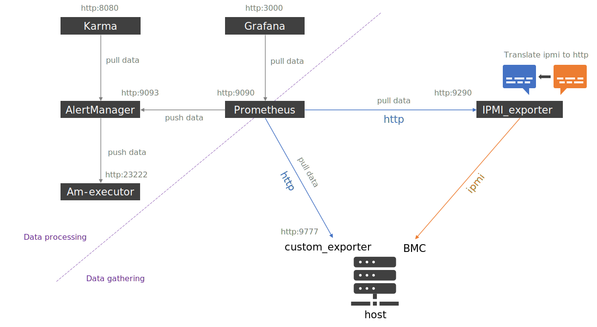

# Prometheus

Note: this role comply with BlueBanquise data-model 1.0.0.

Table of content:

- [Prometheus](#prometheus)
  * [Description](#description)
  * [General instructions](#general-instructions)
    + [Server or/and client](#server-or-and-client)
    + [Default ports](#default-ports)
  * [Basic Server configuration](#basic-server-configuration)
    + [Prometheus configuration](#prometheus-configuration)
      - [Scraping](#scraping)
      - [Alerting](#alerting)
    + [Alertmanager configuration](#alertmanager-configuration)
    + [Karma configuration](#karma-configuration)
  * [Basic Client configuration](#basic-client-configuration)
  * [IPMI and SNMP](#ipmi-and-snmp)
  * [Advanced usage](#advanced-usage)
    + [Manipulate firewall](#manipulate-firewall)
    + [Splitting services](#splitting-services)
  * [Changelog](#changelog)

## Description

This role deploys Prometheus (server/client) with related ecosystem:

* Prometheus (scrap metrics, store them, evaluate alerts)
* Alertmanager (manage alerts by grouping them, sending mails, etc)
* Karma (a dashboard for AlertManager)
* ipmi_exporter
* snmp_exporter
* exporters:
   * slurm_exporter
   * node_exporter
   * ...
* Custom exporter python modules

The role provides a basic configuration that should match 80% of the cluster's
needs. An advanced configuration for specific usages is available and described
after the basic part.

## General instructions

You can refer to this diagram to help understanding of the following readme.



### Server or/and client

**Server part** of the role deploys Prometheus, Alertmanager, Karma,
ipmi_exporter, snmp_exporter, and their respective configuration files and
service files.

To install server part, set `prometheus_server` to `true` at role invocation
vars. See server configuration bellow for more details.

**Client part** of the role deploys other exporters or custom exporter
python modules on clients.

To install client part, set `prometheus_client` to `true` at role invocation
vars. See client configuration bellow for more details.

**Important**: while server related variables are dedicated to server
configuration, client variables are used by **both** client and server part of
the role.

### Default ports

* Prometheus is available by default at http://localhost:9090
* Alertmanager is available by default at http://localhost:9093
* Karma is available by default at http://localhost:8080 (admin / admin)

## Basic Server configuration

Playbook example:

```yaml
---
- name: Deploy prometheus server
  hosts: mg_managements
  roles:
    - role: prometheus
      vars:
        prometheus_server: true
```

In the basic usage, the server role will install and setup the following tools:

* Prometheus: scrap and store metrics, fire alerts.
* Alertmanager: manage alerts fired by Prometheus.
* Karma: dashboard to monitor alerts managed by Alertmanager.
* ipmi_exporter: translate ipmi data to http scrapable by Prometheus.
* snmp_exporter: translate snmp data to http scrapable by Prometheus.

Which means all of these services will be running on the same management host.

To manage what server part of the role should install and setup, defaults
variables can be used. The following variables, with their default values shown
here, are available:

```yaml
prometheus_server_manage_prometheus: true
prometheus_server_manage_alertmanager: true
prometheus_server_manage_karma: true
prometheus_server_manage_ipmi: false
prometheus_server_manage_snmp: false
```

### Prometheus configuration

#### Scraping

By default, role will inherit from values set in its defaults folder.
You may wish to update these values to your needs, as these values set the
different timings used by Prometheus.

To do so, create file *inventory/group_vars/all/prometheus.yml* with the
following content (tuned to your needs):

```yaml
prometheus_server_configuration:
  global_scrape_interval: 1m
  global_evaluation_interval: 2m
```

To understand the meaning of these values, refer to:

* https://prometheus.io/docs/prometheus/latest/configuration/configuration/#scrape_config
* https://www.robustperception.io/whats-the-difference-between-group_interval-group_wait-and-repeat_interval

**Warning**: size your storage available for Prometheus database according to
the size of the cluster and the scrape_interval set here.

These timings will apply to all exporters scraping. It is however possible to
tune specific timings for each exporter. This part is covered in the client
part of this readme.

#### Alerting

It is key to understand that in the Prometheus ecosystem, alerts are calculated
and fired **by Prometheus** and not Alertmanager. Alertmanager is a tool to
managed alerts that were fired by Prometheus (group alerts, send emails, etc).

By default, the role will only add a simple alerts file into the
/etc/prometheus/alerts folder. This file contains a basic alert that trigger when
an exporter is down.

You will probably wish to add more alerts. You can add more files in this same
directory, and these will be loaded by Prometheus at startup.

To do so, either add them manually using another role (like [generic psf](https://github.com/bluebanquise/community/blob/main/roles/generic_psf)), or
add them in the inventory by adding them in the file
*inventory/group_vars/all/prometheus_alerts.yml*. For example:

```yaml
prometheus_server_alerts:
  - alert: HostOutOfMemory
    expr: node_memory_MemAvailable_bytes / node_memory_MemTotal_bytes * 100 < 10
    for: 2m
    labels:
      severity: warning
    annotations:
      summary: Host out of memory (instance {{ $labels.instance }})
      description: Node memory is filling up (< 10% left)\n  VALUE = {{ $value }}\n  LABELS: {{ $labels }}
  - alert: HostOutOfInodes
    expr: node_filesystem_files_free{mountpoint ="/rootfs"} / node_filesystem_files{mountpoint="/rootfs"} * 100 < 10 and ON (instance, device, mountpoint) node_filesystem_readonly{mountpoint="/rootfs"} == 0
    for: 2m
    labels:
      severity: warning
    annotations:
      summary: Host out of inodes (instance {{ $labels.instance }})
      description: Disk is almost running out of available inodes (< 10% left)\n  VALUE = {{ $value }}\n  LABELS: {{ $labels }}
```

### Alertmanager configuration

Alertmanager parameters can be updated by adding into the previously created
file *inventory/group_vars/all/prometheus.yml* the following content, tuned to
your needs:

```yaml
prometheus_server_alertmanager_configuration:
  group_wait: 1m
  group_interval: 10m
  repeat_interval: 3h
```

To understand meaning of these values, refer to [main documentation](https://prometheus.io/docs/alerting/latest/configuration/) or to [this page](https://www.robustperception.io/whats-the-difference-between-group_interval-group_wait-and-repeat_interval).

### Karma configuration

Few Karma parameters can be defined if needed.

To set kerma username and password, use:

```yaml
prometheus_karma_username: admin
prometheus_karma_password: admin
```

Default is admin / admin.

## Basic Client configuration

Playbook example:

```yaml
---
- name: Deploy prometheus server
  hosts: mg_managements
  roles:
    - role: prometheus
      vars:
        prometheus_client: true
```

The client side of the role install and start local exporters on nodes. It is
also used during server side of the role to know what to scrap on which group
of nodes.

Each exporter has its own http port. For example, node_exporter is available at
http://localhost:9100 .

In order for this role to install and start exporters on the host, a
configuration is required in the Ansible inventory: a file is needed for each
**equipment_profile** group that should be monitored.
(See main documentation of BlueBanquise core to know what is an
equipment_profile.)

For example, to have equipment_typeL nodes installing and starting the
node_exporter exporter, you will need to create file
*inventory/group_vars/equipment_typeL/monitoring.yml* with the following content:

```yaml
ep_prometheus_exporters:
  - name: node_exporter
    package: node_exporter
    service: node_exporter
    port: 9100
```

For client part of the role, this means: all equipment_typeL nodes will install
node_exporter package and start node_exporter service.
For server part of the role, this means: all equipment_typeL nodes have to be
scraped on port 9100.
Again, client side variables are used by both client and server part of the role.

Another example: on your management nodes, you may wish to have more exporters
setup to monitor more things. This would be here, assuming managements
nodes are from equipment group equipment_typeM, a file
*inventory/group_vars/equipment_typeM/monitoring.yml* with the following content:

```yaml
ep_prometheus_exporters:
  - name: node_exporter
    package: node_exporter
    service: node_exporter
    port: 9100
  - name: ha_cluster_exporter
    package: ha_cluster_exporter
    service: ha_cluster_exporter
    port: 9664
  - name: slurm_exporter
    package: slurm_exporter
    service: slurm_exporter
    scrape_interval: 5m
    scrape_timeout: 5m
    port: 9817
```

Note here that you can also set **scrape_interval** and **scrape_timeout**
values for each exporter here. These will override default values only for this
exporter.

Note that ha_cluster_exporter and slurm_exporter are documented in the stack,
but no packages are provided by the BlueBanquise project. Refer to the
monitoring main documentation to get additional details about these exporters.

## IPMI and SNMP

ipmi_exporter and snmp_exporter behave differently: they act as translation
gateways between Prometheus and the target. Which means, if you wish for example
to query IPMI data of a node, you do not install the exporter on the node itself.
This is why, in the basic configuration, these two exporters are installed by
the server part of the role and not the client part.

To have the exporter installed by the server part of the role, set their
respective variables to true or false, according to your needs:

```yaml
prometheus_server_manage_ipmi: true
prometheus_server_manage_snmp: false
```

You then need to specify for each equipment_profile if you wish ipmi or/and snmp
to be scraped. To do so, set **ep_prometheus_ipmi** or/and
**ep_prometheus_snmp** under ep_monitoring to true. This can be combined
(or not) with exporters.

```yaml
ep_prometheus_ipmi: true
ep_prometheus_ipmi_scrape_interval: 5m
ep_prometheus_ipmi_scrape_timeout: 5m
ep_prometheus_snmp: false
ep_prometheus_ipmi_scrape_interval:
ep_prometheus_ipmi_scrape_timeout:
```

Since ipmi and snmp data are scraped using ipmi_exporter and snmp_exporter as
"translators", the server part of the Prometheus role will take these
variables into account to generate Prometheus, ipmi_exporter and snmp_exporter
configuration files.

If variables are not set, role will consider them to false. This avoid
having to define them for each equipment_profile when not needed.

Note that you can set custom scrape_interval and scrape_timeout for ipmi or snmp
using dedicated variables shown in the example above.

## Advanced usage

### Manipulate firewall

On some system, you may wish that the whole server side ecosystem is reachable
from the network or not (you may wish to reach it using an ssh port forwarding
only for example).

If variable `prometheus_firewall_open` is set to `true`, Prometheus and AlertManager will be reachable from the network on the `prometheus_server_firewall_zone` defined (default public). If not, firewall ports related to both will remain closed.

Example:

```yaml
prometheus_firewall_open: true
prometheus_server_firewall_zone: internal
```

### Splitting services

For some specific configurations, it is needed to split services over multiple
hosts.
For example to force ipmi_exporter and/or snmp_exporter to be deployed on another host than the one running
 Prometheus.

To do so, disable ipmi and snmp on the hosts running Prometheus (host1), using this
configuration as host1 dedicated hostvars :

```yaml
prometheus_server_manage_prometheus: true
prometheus_server_manage_alertmanager: true
prometheus_server_manage_karma: true
prometheus_server_manage_ipmi: false
prometheus_server_manage_snmp: false
```

And activate them on the host you wish them to run (host2), using the opposite values for host2 dedicated hostvars:

```yaml
prometheus_server_manage_prometheus: false
prometheus_server_manage_alertmanager: false
prometheus_server_manage_karma: false
prometheus_server_manage_ipmi: true
prometheus_server_manage_snmp: true
```

To ensure everyone can communicate, set now these global variables in
group_vars/all (these variables are all set to localhost by default):

```yaml
prometheus_server_prometheus_host: host1
prometheus_server_alertmanager_host: host1
prometheus_server_karma_host: host1
prometheus_server_ipmi_host: host2
prometheus_server_snmp_host: host2
```

This can be used to spread all main services.

Note: if any `prometheus_server_manage_X` variable is not defined, it is considered `false`.

Warning: if your firewall is running, you may need to open ports for desired
services.

## Changelog

* 1.0.1: Documentation. johnnykeats <johnny.keats@outlook.com>
* 1.0.0: Role creation. Benoit Leveugle <benoit.leveugle@gmail.com>, johnnykeats <johnny.keats@outlook.com>
